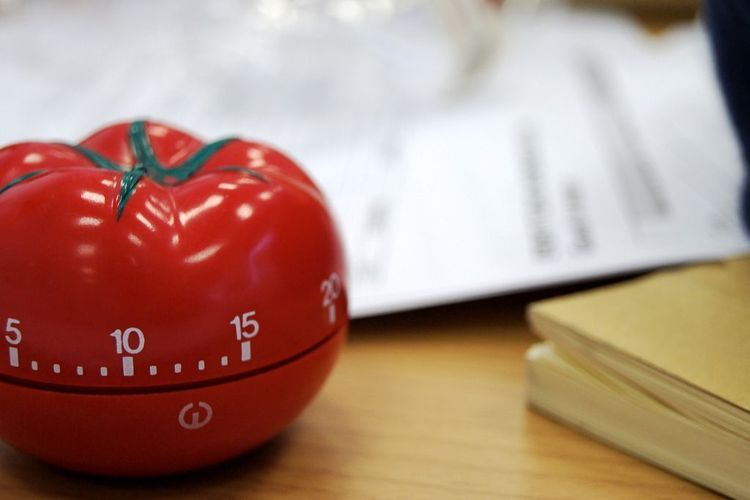

# React Pomodoro

> A simple pomodoro timer, with React

---

- Repository: 
	- `challenge-react-pomodoro`
- Type of Challenge: 
	- `Learning Challenge`
- Duration: 
	- `3 days`
- Deadline: 
	- `30/01/20 16:00`
- Team challenge : 
	- `solo`

## Introduction

We will create a [pomodoro timer](https://en.wikipedia.org/wiki/Pomodoro_Technique) with React. This will be a *static* project, you will just create the front-end in React. 

## What to do

### Setup you environment

Create your React application with the `create-react-app` CLI. 

>People who want to try something new could also use a bundler like [Parcel](https://parceljs.org) to set up your environment. Have a look at [this excelent tutorial](https://scotch.io/tutorials/setting-up-a-react-project-with-parcel) to help you with Parcel.js.

### Functionalities

The *timer* has a default value of **20 minutes**, this value can be changed with **plus (+)** and **minus (-)** buttons. These buttons will change how many minutes the timer will take. This can only be changed when the timer is *stopped*. When the timer is couting down, the (+) and (-) buttons are *inactive*.

The **start** button has to change his state to a **reset** button when the counter is started. 

When the timer reaches its end, display a modal box which tells the user to *take a break*. This modal contains two buttons. One to close the window, and one to start a new timer.

### Notes

- Before you start, create a mockup of you project. 

- Identify all the different components you will have to create. [(think in react!)](https://reactjs.org/docs/thinking-in-react.html)

- Structure you files in an orderly fashion
